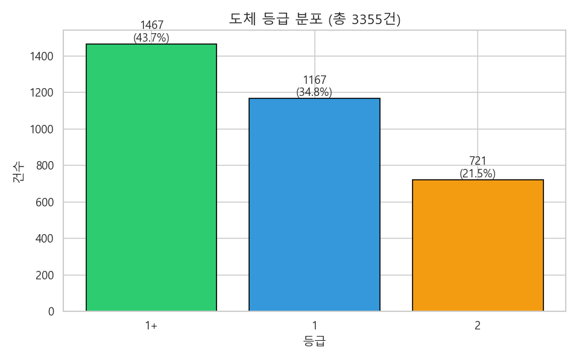
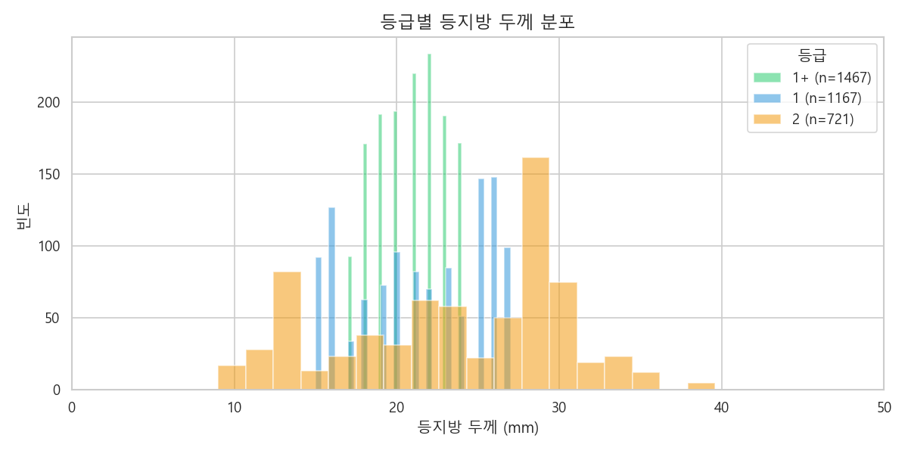
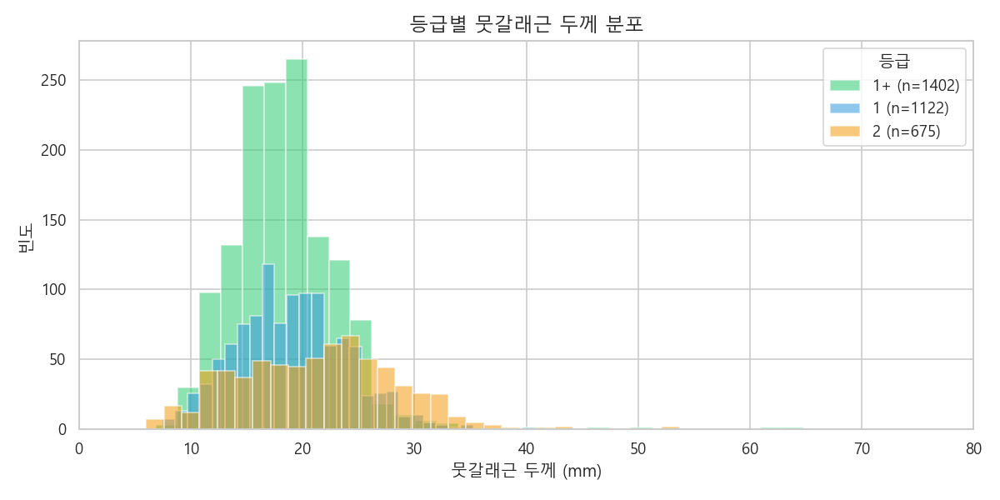
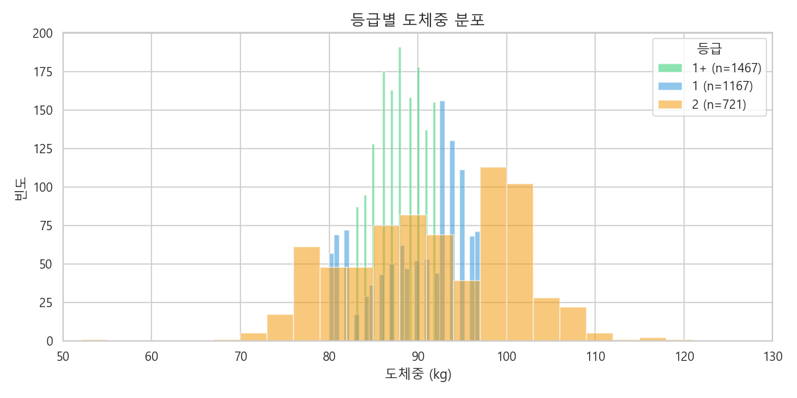
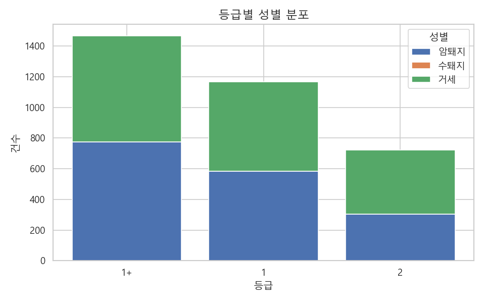
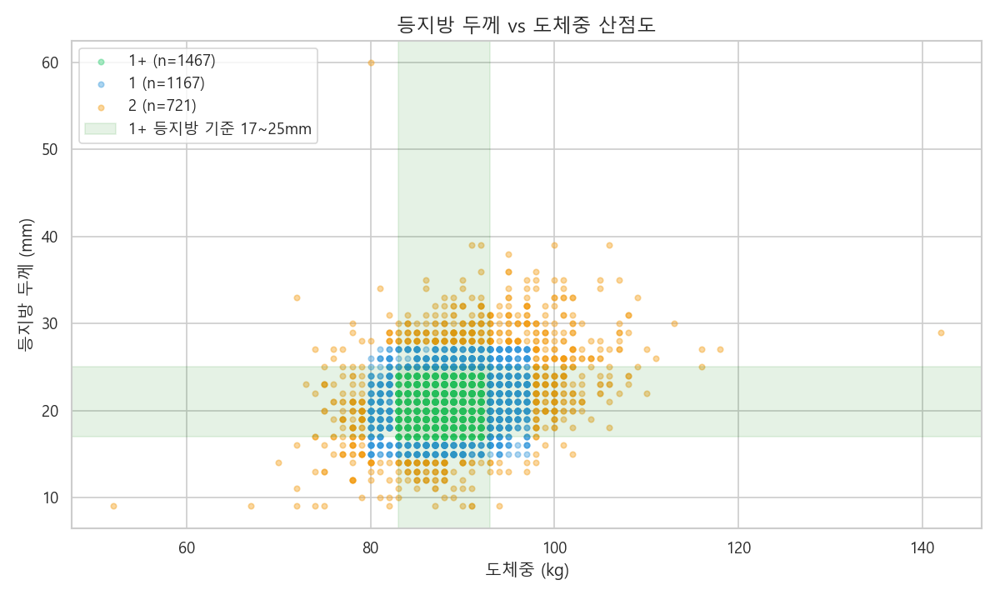
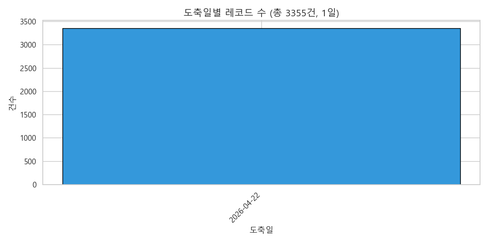

# 데이터셋 분석 리포트

> 분석 대상: `vlm/data/dataset.jsonl` (3,355건)
> 분석 코드: [`notebooks/dataset_analysis.py`](./dataset_analysis.py)
> 시각화: `docs/figures/`

---

## 핵심 요약

| 항목 | 값 |
|---|---|
| 총 레코드 | 3,355건 |
| 도축 기간 | 2026-04-22 (단일 일자) |
| 등급 분포 | 1+ 43.7% / 1 34.8% / 2 21.5% |
| 성별 분포 | 암퇘지 1,664 / 수퇘지 1,691 (거세 없음) |
| 등지방 평균 | 21.6mm (범위 9~60mm) |
| 뭇갈래근 평균 | 19.2mm (범위 6~65mm) |
| 도체중 평균 | 89.3kg (범위 52~142kg) |

---

## 1. 등급 분포



- **1+ 등급이 43.7%로 최다**: 출하 도체 품질이 전반적으로 우수
- 등외(D) 등급 0건 — 학습 데이터에는 정상 케이스만 존재
  → 등외 시나리오는 hand-crafted 샘플(`backfat_error_case.json` 등)로만 평가됨
- **클래스 불균형**: 2등급이 가장 적음 (721건)

---

## 2. 등급별 등지방 두께 분포



- 1+ 등급: **15~25mm 구간에 집중** (한국 1+ 기준 17~25mm 와 일치)
- 1 등급: 더 넓은 분포, 17~30mm 위주
- 2 등급: 양극화 (10mm 이하 + 30mm 이상)
- **모델이 학습할 핵심 룰**: "등지방 ∈ [17,25] && 도체중 ∈ [83,93] → 1+ 등급"

---

## 3. 등급별 뭇갈래근 두께 분포



- 등급별 차이가 등지방보다 약함
- 보조 지표 (육질의 단단함 표시)로 활용
- 모델은 reference text 에서 "육질 지표 - 클수록 우수" 로 표현

---

## 4. 등급별 도체중 분포



- 1+ 등급: **83~93kg 구간 집중** (한국 1+ 기준 일치)
- 1 등급: 78~98kg 의 더 넓은 범위 허용
- 2 등급: 큰 분산 (60kg ~ 110kg)

---

## 5. 등급별 성별 분포



- 등급과 성별 간 강한 상관 없음 (1+ 에서도 암/수 비슷)
- 거세(barrow) 없음 — 운영 환경 특성

---

## 6. 등지방 vs 도체중 산점도



녹색 박스 = 1+ 등급 표준 영역 (등지방 17~25mm, 도체중 83~93kg)

- 1+ 등급 산점이 박스 내부에 밀집
- 1 등급은 박스 외곽에 분포
- 2 등급은 외곽 + 일부 박스 침범 (다른 기준 위반)
- **1+ 등급의 시각적 정의가 명확** — 모델이 학습하기 좋은 도메인

---

## 7. 도축일 분포



- **단일 일자 (2026-04-22)** 의 데이터로 학습됨
- 시간적 일반화 미검증
- 향후 다른 날짜 데이터 추가 시 재학습 권장

---

## 학습 전략에 미치는 시사점

### 강점
1. **등급별 측정값 패턴 명확** → LoRA 가 "수치 → 등급 근거" 매핑 학습 용이
2. **데이터 양 (3,355건) 충분** → 6,610 학습 샘플 확보
3. **1+/1/2 균형이 학습에 유리** (43:35:22, 등외 부재는 한계)

### 약점
1. **단일 일자**: 시간적 일반화 미검증
2. **단일 도축장**: 다른 시설 환경에 일반화 불확실
3. **등외 케이스 부재**: error_code 비정상 시나리오는 합성 데이터로만 학습
4. **이미지 다양성 제한**: 같은 카메라/조명/각도 → 비전 인코더 학습 효과 제약

### v2 학습 (Vision LoRA + AI 이미지) 의의
- AI 오버레이 이미지가 명시적 시각 단서(등지방 영역, 측정 라인) 제공
- Vision Tower LoRA 가 도메인 특화 시각 패턴 학습 가능
- 단, 이미지 다양성이 제한적이라 효과는 제한적일 수 있음 → 4주차 벤치마크로 검증

---

## 재현 방법

```bash
conda activate vlm
python notebooks/dataset_analysis.py
# → docs/figures/ 에 7장의 .png 생성
```
